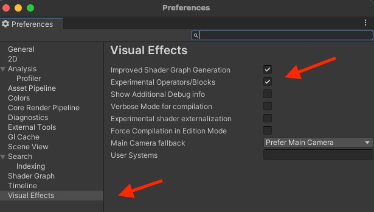
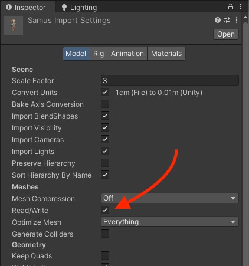
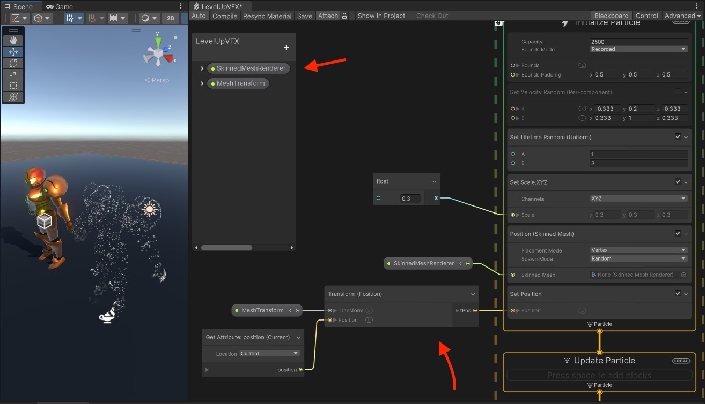
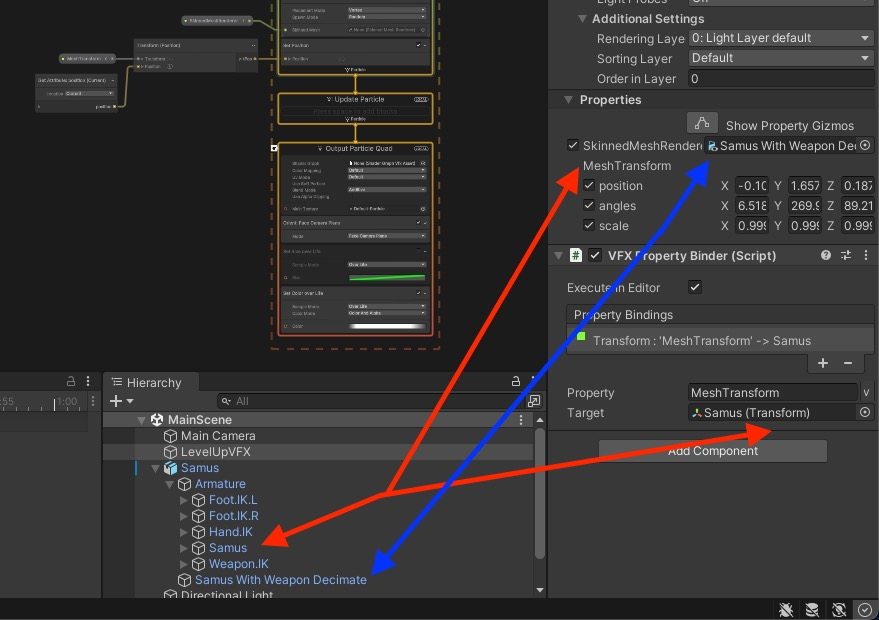
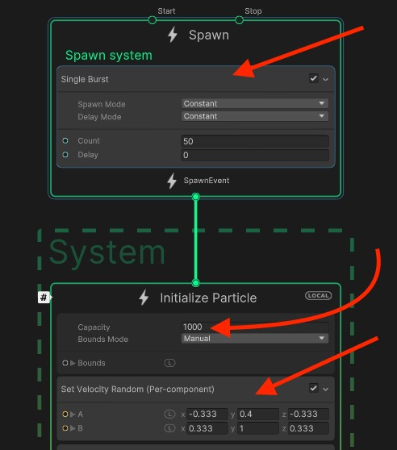
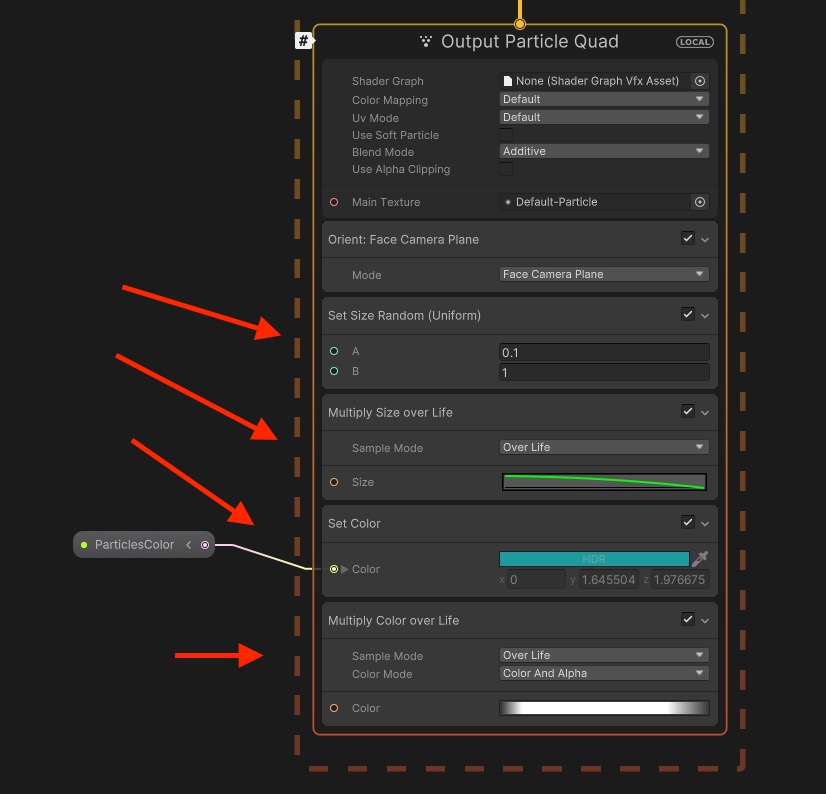
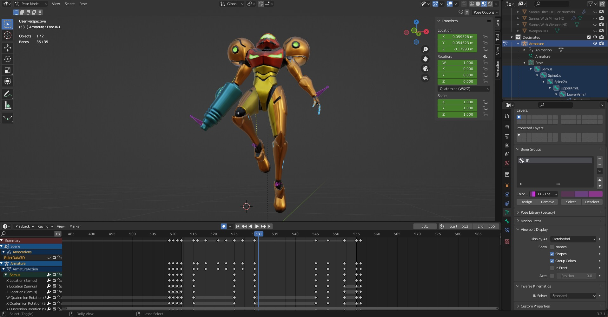

# Character Level Up VFX

Character Level Up VFX implemented with VFX Graph and Skinned Mesh in **Unity 2021.3.16f1**

## Screenshots

## Table of Content

- [Character Level Up VFX](#character-level-up-vfx)
  - [Screenshots](#screenshots)
  - [Table of Content](#table-of-content)
  - [Resources](#resources)
  - [Experimental Features in VFX Graph](#experimental-features-in-vfx-graph)
  - [Read/Write Mesh Vertices](#readwrite-mesh-vertices)
  - [Skinned Mesh Position](#skinned-mesh-position)
    - [Bind the Properties](#bind-the-properties)
    - [Set Position on Initialize](#set-position-on-initialize)
    - [Set Position on Update](#set-position-on-update)
  - [Particles Burst](#particles-burst)
  - [Level Up Animation](#level-up-animation)

## Resources

- [Level Up Effect Tutorial by Gabriel Aguiar](https://www.youtube.com/watch?v=tnUPngBEnQ8)
- [Skinned Mesh Sampling in Unity VFX Graph](https://www.youtube.com/watch?v=bIMyCKr0bFs)
- [Set Position Skinned Mesh](<https://docs.unity3d.com/Packages/com.unity.visualeffectgraph@12.0/manual/Block-SetPosition(Mesh).html>)

## Experimental Features in VFX Graph

- Enable the experimental features in the editor preferences.

## Read/Write Mesh Vertices

- In the .FBX import settings for the model, enable read/write to let VFX Graph access the vertices of the mesh.

## Skinned Mesh Position

- Use a **Position (Skinned Mesh) Node** to set the position of the **particles** on the **vertices** of the selected **skinned mesh**.
- Set the **Position** by using a **Transform Position Node**, using the **Transform** of the **skinned mesh** and the **Current Position** of the **particle**.

<!-- 1.mp4 -->
https://user-images.githubusercontent.com/4588601/213369294-a6247544-d432-49c3-af19-13c027e88283.mp4

### Bind the Properties

- Set the **Skinned Mesh Renderer** to the **Skinned Mesh Renderer** in the **FBX model** we imported.
- Use a **VFX Property Binder** to set the **Mesh Transform** to the corresponding **root bone** of the **rig**.

### Set Position on Initialize

- If we just set the position on initialize, the effect we achieve looks like a trail.

<!-- 2.mp4 -->
https://user-images.githubusercontent.com/4588601/213369430-aedebe22-4396-4b20-931e-e44244872748.mp4

<!-- 3.mp4 -->
https://user-images.githubusercontent.com/4588601/213369436-42a1f6e8-3afc-4e22-a5c9-2c6373707d10.mp4

### Set Position on Update

- If we just set the position on update, the particles follow the mesh, not what we want now.

<!-- 4.mp4 -->
https://user-images.githubusercontent.com/4588601/213369491-923332b9-afac-459f-9099-9b74e84e7c1a.mp4

<!-- 5.mp4 -->
https://user-images.githubusercontent.com/4588601/213369493-616b37df-d05d-40a5-a10b-9ea709b0de87.mp4

<!-- 6.mp4 -->
https://user-images.githubusercontent.com/4588601/213369499-aedb34f1-71c4-4eef-98be-b74486e06e0d.mp4

## Particles Burst

- Define a Single Burst of particles, we will later trigger it from code.
- Set the particles to have a Sprite, Color, Size over Time and Velocity.

<!-- 7.mp4 -->
https://user-images.githubusercontent.com/4588601/213615413-75201d7d-d194-4ce1-918c-d86cf365394c.mp4
## Level Up Animation

- Animate the character in Blender, create a levitation animation for the level up vfx.

<!-- 8.mp4 -->

